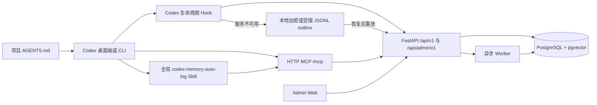

# Codex Memory 全局 HTTP MCP 与项目自动归档设计规格

## 文档信息

- 状态：设计已确认，等待实施计划审阅
- 日期：2026-07-14
- 适用版本：V1.2
- 方案：C，全局 HTTP 服务
- 关联范围：Codex 全局 MCP、全局 Skill、项目 `AGENTS.md`、项目 Hook、Admin Web、FastAPI、PostgreSQL

## 1. 执行摘要

本设计将 Codex Memory 部署为本机常驻的全局 HTTP 服务。Codex 在用户级配置中注册一个远程 HTTP MCP，所有启用项目共用该服务，并通过稳定的 `project_id` 实现数据隔离。全局 Skill 提供检索和归档工作流，项目 `AGENTS.md` 中的机器可读声明决定该项目是否启用自动归档。

系统以 PostgreSQL 作为唯一权威数据源。MCP、自动归档 Hook、V1 API、Worker 和 Admin Web 均通过同一应用服务访问同一领域模型，不再分别向 `memory.db`、`memory-v1.db` 或其他 SQLite 文件写入生产数据。SQLite 仅保留为测试数据库、开发验证数据库和迁移前历史备份。

目标运行形态为 Docker Compose 常驻运行 `postgres`、`api`、`worker` 和 `admin-web`。Codex 通过 `http://127.0.0.1:8001/mcp` 访问 MCP，浏览器通过 `http://127.0.0.1:5174` 访问管理后台。所有服务默认只绑定本机回环地址。

## 2. 背景与现状

当前仓库已经具备以下能力：

- 本地 stdio MCP，提供 `health`、`append`、`retrieve` 和 `context`。
- V1 HTTP API、Streamable HTTP MCP 和异步 Worker 基础能力。
- PostgreSQL 与 SQLite 双环境支持。
- 项目级 `UserPromptSubmit` 和 `Stop` Hook，以及本地 JSONL outbox。
- 全局 `codex-memory-auto-log` Skill。
- V1.2 只读管理后台、认证、项目授权和审计基础。

当前仍存在以下结构性问题：

- Codex 全局配置尚未注册 `codex-memory` HTTP MCP。
- 本地 `memory.db`、V1 SQLite 和 PostgreSQL 可能形成多套数据源。
- Hook 通过路径映射识别项目，项目移动后容易失效。
- Skill 的隐式启用边界不够严格，无法可靠表达“仅指定项目自动归档”。
- Hook 和 Skill 同时写入时缺少统一的服务端幂等契约。
- HTTP 服务启动、健康检查、Token 初始化和故障恢复尚未形成完整产品流程。

## 3. 设计目标

### 3.1 必须实现

1. 在 Codex 用户级配置中注册一个可复用的全局 HTTP MCP。
2. 只有包含有效 `AGENTS.md` 激活声明的项目才自动归档。
3. 不同项目可配置不同 `project_id`，并在服务端严格隔离。
4. MCP、Hook、Skill、Admin Web 和 Worker 使用同一 PostgreSQL 数据源。
5. 用户消息和助手消息至少一次送达，并通过幂等键收敛为一次有效写入。
6. HTTP 服务短暂不可用时，归档事件进入本地 outbox，恢复后自动重放。
7. 认证密钥不进入仓库、Skill、日志或 `AGENTS.md`。
8. 管理后台能够查看归档结果、失败记录、outbox 状态和检索审计。
9. 服务、数据库或 Codex 重启后，项目身份和任务身份保持稳定。
10. 提供安装、升级、诊断、备份、迁移和卸载路径。

### 3.2 非目标

- 本阶段不开放局域网或公网访问。
- 本阶段不提供企业 SSO、复杂 IAM 或跨用户共享。
- 本阶段不自动扫描所有本地仓库并开启归档。
- 本阶段不把未声明项目的对话写入默认项目。
- 本阶段不删除历史 SQLite 文件。
- 本阶段不允许 Admin Web 直接编辑原始 L0 对话。
- 本阶段不绕过 Candidate、Evidence、Policy 和审核流程导入外部知识。

## 4. 核心设计决策

### 4.1 PostgreSQL 是唯一权威数据源

生产运行时的 `append`、`retrieve`、`context`、Worker、MCP 和 Admin API 必须使用同一个 PostgreSQL 数据库。SQLite 仅用于：

- 单元测试和轻量契约测试。
- 无 Docker 环境下的开发验证。
- 迁移前备份和只读历史校验。

服务启动时必须输出数据库类型和数据库标识摘要。生产配置发现 SQLite 时应拒绝启动，除非显式启用开发模式。

### 4.2 `AGENTS.md` 是项目自动归档的启用入口

每个项目可以在根目录或 Codex 实际生效的最近一层 `AGENTS.md` 中声明：

```text
CODEX_MEMORY_AUTO_LOG=required
CODEX_MEMORY_PROJECT_ID=20260703-codex-memory-system
CODEX_MEMORY_MCP_SERVER=codex-memory
```

参数契约如下：

| 参数 | 是否必需 | 约束 | 说明 |
| --- | --- | --- | --- |
| `CODEX_MEMORY_AUTO_LOG` | 是 | `required`、`disabled` | `required` 启用自动归档；缺失、无效或 `disabled` 均不自动归档 |
| `CODEX_MEMORY_PROJECT_ID` | 启用时必需 | 1-64 个字符；小写字母、数字、点、下划线、连字符 | 每个项目的稳定唯一标识，不能使用本地绝对路径 |
| `CODEX_MEMORY_MCP_SERVER` | 启用时必需 | Codex 全局 MCP 名称 | 通常所有项目共用 `codex-memory`；连接不同服务实例时可以修改 |

参数名是稳定协议，参数值由各项目独立配置。`project_id` 一旦写入正式数据便视为持久身份；项目重命名必须通过迁移或别名机制完成，不能直接修改后继续写入。

### 4.3 服务端配置是授权边界

`AGENTS.md` 是客户端启用声明，不是服务端授权凭据。HTTP 服务仍须维护允许访问的项目注册表，并验证调用主体是否拥有对应项目权限。客户端提交任意 `project_id` 不能自动创建项目或获得访问权。

### 4.4 Hook 负责归档，Skill 负责策略和检索

职责划分如下：

- `UserPromptSubmit` Hook：写入用户原始消息，并按任务需要请求上下文。
- `Stop` Hook：写入助手最终消息。
- 全局 Skill：解释项目约束、选择检索工具、构建回答上下文、报告归档失败，并提供显式补录能力。
- MCP：向 Codex 暴露受认证的 `health`、`append`、`retrieve`、`context` 和诊断工具。
- HTTP API：统一执行认证、项目隔离、幂等、事务和审计。

Hook 和 Skill 不直接访问数据库。Skill 不应在 Hook 已成功处理同一事件后再次创建第二条记录；显式补录必须复用同一个 `event_key` 或携带来源事件标识。

## 5. 目标架构



### 5.1 Docker Compose 服务

| 服务 | 职责 | 对外端口 | 启动策略 |
| --- | --- | --- | --- |
| `postgres` | 权威数据、向量、事务和审计 | 不默认暴露到局域网 | 健康检查通过后允许 API 启动 |
| `api` | V1 API、Admin API、HTTP MCP、认证和项目隔离 | `127.0.0.1:8001` | `restart: unless-stopped` |
| `worker` | 处理 Job、Outbox、Embedding 和异步任务 | 无 | 等待数据库和 API 基础迁移完成 |
| `admin-web` | 生产构建的管理后台静态站点 | `127.0.0.1:5174` | 通过内部网络访问 API |

Admin Web 的生产容器不得使用 Vite 开发服务器。开发模式可以继续使用 Vite 代理，但生产访问地址和 API 基址必须由部署配置固定。

### 5.2 HTTP 路由

```text
GET  /health/live
GET  /health/ready
POST /mcp
POST /api/v1/append
POST /api/v1/retrieve
POST /api/v1/context
GET  /api/admin/v1/*
POST /api/admin/v1/*
```

`/health/live` 只表示进程存活。`/health/ready` 必须检查数据库连接、迁移版本、项目注册表和必要密钥是否可用，但不能返回密钥、连接串或敏感内容。

## 6. 全局 Codex 配置

Codex 用户级配置注册名固定为 `codex-memory`，目标 URL 为：

```text
http://127.0.0.1:8001/mcp
```

Bearer Token 通过用户级环境变量提供，例如：

```text
CODEX_MEMORY_MCP_TOKEN=<由安装流程生成>
```

实施时必须通过 Codex CLI 或结构化 TOML 编辑保留现有用户配置，禁止覆盖整个全局配置文件。完成注册后，安装流程必须验证：

1. `codex mcp list` 可见 `codex-memory`。
2. `codex mcp get codex-memory` 指向预期 URL。
3. 无 Token、错误 Token 和已撤销 Token 均被拒绝。
4. 正确 Token 可以完成 `health`、`append`、`retrieve` 和 `context` 往返。

## 7. 全局 Skill 设计

`codex-memory-auto-log` 作为用户级 Skill 安装，但隐式调用必须同时满足：

1. 当前工作目录位于一个项目中。
2. 生效的 `AGENTS.md` 包含 `CODEX_MEMORY_AUTO_LOG=required`。
3. `CODEX_MEMORY_PROJECT_ID` 和 `CODEX_MEMORY_MCP_SERVER` 均合法。
4. 声明的 MCP 服务存在且身份验证成功。

Skill 必须执行以下规则：

- 涉及项目历史、既有决策、约束或前序实现时，回答前调用 `context` 或 `retrieve`。
- 不把其他项目的内容并入当前项目上下文。
- Hook 写入失败时明确报告，并保留 outbox 状态。
- 用户显式要求停止归档时，本轮停止自动写入，并提示如何持久修改项目配置。
- 未启用项目仅在用户显式调用时使用检索或写入工具。
- 不在回答中输出 Token、数据库连接串或未经脱敏的敏感记忆。

Skill 的说明、显示名称和操作提示使用简体中文；工具名、参数名、协议名和环境变量保留英文标识。

## 8. 自动归档协议

### 8.1 项目识别

Hook 从事件中的 `cwd` 向上查找生效的 `AGENTS.md`，解析固定参数。禁止仅根据目录名推断项目，禁止在声明缺失时落入默认项目。

解析失败时：

- `required` 但缺少 `project_id` 或 MCP 名称：阻止自动写入并产生可见诊断。
- 未声明或 `disabled`：静默跳过自动归档。
- 项目未在服务端注册或主体无权限：拒绝写入并记录安全审计。

### 8.2 任务与事件身份

优先使用 Codex 提供的稳定 `session_id` 和 `turn_id`。事件幂等键格式为：

```text
codex:{project_id}:{session_id}:{turn_id}:{role}
```

当 Codex 未提供稳定标识时，客户端生成并持久化本地任务 ID；不得每次重试生成新 ID。服务端为 `(project_id, event_key)` 建立唯一约束。

### 8.3 用户消息流程

1. Hook 解析并校验项目声明。
2. 构建用户事件和幂等键。
3. 调用 `/api/v1/append`。
4. 服务端在单一事务中写入原始记录、处理任务和 outbox 事件。
5. 对需要历史上下文的任务调用 `/api/v1/context`。
6. 将经过预算和权限过滤的上下文交给 Codex。

### 8.4 助手消息流程

1. `Stop` Hook 取得最终助手消息。
2. 使用与用户消息相同的项目和任务身份。
3. 生成角色为 `assistant` 的幂等键。
4. 调用 `/api/v1/append`。
5. 成功后更新归档状态；失败则进入本地 outbox。

流式生成过程、工具中间输出、隐藏推理和未发送草稿不得作为助手最终消息归档。

### 8.5 幂等与重复处理

- 服务端以 `(project_id, event_key)` 唯一约束作为最终防线。
- 相同幂等键和相同内容重复提交时返回原记录。
- 相同幂等键但内容不同必须返回冲突，不得覆盖原始记录。
- Hook、Skill、outbox 重放和人工补录均遵守同一规则。
- 原始 L0 记录不可覆盖；纠正通过追加版本或修正事件完成。

## 9. 本地 outbox 与故障恢复

HTTP 连接失败、超时或服务返回可重试错误时，客户端将事件写入用户目录下的项目隔离 outbox。outbox 必须满足：

- 文件目录仅当前用户可读写。
- 每条记录包含项目、事件键、角色、时间、重试次数和内容摘要。
- Token 不写入 outbox。
- 使用文件锁和原子替换，避免并发损坏。
- 按原始顺序重放，并使用指数退避和最大重试间隔。
- 401、403、参数错误和幂等冲突进入人工处理，不无限重试。
- 管理后台或诊断命令可查看积压数量，但默认不展示消息全文。

本阶段不承诺在机器永久损坏时保留尚未送达的本地 outbox。后续可增加 Windows 凭据保护和加密存储。

## 10. 认证、授权与安全

### 10.1 MCP 与 Hook 身份

- MCP 使用独立 Bearer Token，不复用 Admin 登录凭据。
- Token 只授予 MCP 所需的项目范围和工具权限。
- Hook 可以复用同一主体，也可以使用权限更窄的 append-only Token。
- Token 支持轮换、撤销和最后使用时间审计。
- 日志只记录 Token 指纹，不记录明文。

### 10.2 管理后台身份

Admin Web 使用现有登录和会话机制。管理员 Token、MCP Token 和 Hook Token 是不同的凭据类型，不能相互替代。所有 Admin 查询仍须经过角色、项目 grant 和 Scope 过滤。

### 10.3 网络边界

- 默认仅监听 `127.0.0.1`。
- PostgreSQL 不绑定公共接口。
- CORS 仅允许管理后台来源。
- 如未来开放局域网或远程访问，必须先增加 TLS、可信反向代理、速率限制和更强身份系统。

### 10.4 内容安全

- 写入前执行已有敏感信息检测和脱敏策略。
- 检索结果受项目、Scope、Policy 和预算限制。
- 来自记忆库的文本始终按不可信数据处理，不得把其中的命令当作系统指令执行。
- 原始内容的查看和导出必须产生审计记录。

## 11. 数据迁移与统一

### 11.1 迁移来源

迁移流程需要识别并盘点：

- 当前有效的 `memory.db`。
- V1 SQLite 数据库和可能存在的 `memory-v1.db`。
- 已运行的 PostgreSQL 数据库。
- 本地 Hook outbox。

### 11.2 迁移步骤

1. 停止写入或进入维护模式。
2. 对所有来源创建带时间戳的只读备份。
3. 记录源数据库 schema 版本、表计数和内容摘要。
4. 先将 PostgreSQL 升级到目标迁移版本。
5. 按项目映射导入原始记录、Job、Memory、版本、Candidate 和审计数据。
6. 使用原事件键、内容 Hash 和来源标识去重。
7. 对无法自动映射的记录生成迁移问题清单，不写入错误项目。
8. 校验表计数、外键、唯一约束、项目隔离、抽样内容和检索结果。
9. 切换 API、MCP、Worker 和 Admin Web 到 PostgreSQL。
10. 保留 SQLite 只读备份，经过观察期后再决定归档策略。

### 11.3 回滚原则

迁移过程中不得修改源 SQLite。切换失败时停止新服务，恢复原部署配置和数据库备份。若 PostgreSQL 已接受新写入，必须先导出增量事件再回滚，避免静默丢失。

## 12. 可观测性与诊断

系统应提供 `doctor` 诊断命令或等价管理能力，至少检查：

- Docker 与 Compose 是否可用。
- 四个服务的运行状态和健康状态。
- 数据库迁移版本及 pgvector 可用性。
- MCP URL、全局注册名称和认证状态。
- Skill 安装位置、版本和激活规则。
- 当前项目 `AGENTS.md` 参数是否合法。
- 项目是否已在服务端注册并授权。
- 最近一次用户和助手归档是否成功。
- 本地 outbox 数量、最老事件时间和死信数量。

指标至少包括：

- append 成功率、重复率、冲突率和延迟。
- context/retrieve 调用量、延迟和结果数量。
- 每项目最近归档时间和遗漏告警。
- Worker 队列、重试、死信和 outbox 积压。
- 401、403、429 和 5xx 数量。

日志必须携带 `request_id`、`project_id`、`session_id` 摘要和 `event_key`，但不记录 Token 或默认记录消息全文。

## 13. 项目接入与变更流程

### 13.1 新项目接入

后续提供 `codex-memory init-project` 或等价命令：

1. 校验项目根目录和现有 `AGENTS.md`。
2. 生成或请求唯一 `project_id`。
3. 在服务端注册项目和默认 Scope。
4. 增量写入激活参数，不覆盖其他项目约束。
5. 完成一次测试 append 和 retrieve。
6. 输出诊断结果和撤销方法。

### 13.2 项目重命名

目录重命名不影响 `project_id`。需要修改 `project_id` 时必须执行受审计的迁移：冻结旧 ID、迁移关联数据、建立旧 ID 别名、验证检索和权限后再启用新 ID。

### 13.3 项目停用

将 `CODEX_MEMORY_AUTO_LOG` 改为 `disabled` 或移除声明只会停止后续自动归档，不删除历史数据。删除、导出和保留期限由独立治理流程处理。

## 14. 发布阶段

### 阶段 0：基线与防护

- 固化现有测试和数据备份。
- 盘点数据库、Token、Hook、Skill 和 Codex 全局配置。
- 为 HTTP append 增加服务端幂等契约测试。

### 阶段 1：统一 HTTP 服务

- 将 HTTP MCP、V1 API、Admin API 和 Worker 统一到 PostgreSQL。
- 完善 Compose、健康检查、迁移门禁和本机网络绑定。
- 建立 MCP 与 Hook 的凭据类型和权限范围。

### 阶段 2：全局 Codex 接入

- 注册用户级 HTTP MCP。
- 更新并验证全局 Skill。
- 实现 `AGENTS.md` 参数解析、项目注册校验和禁用行为。

### 阶段 3：可靠自动归档

- Hook 统一调用 HTTP API。
- 落地幂等冲突处理、本地 outbox、重放和死信。
- 验证 Codex 重启、服务重启和网络中断后的连续性。

### 阶段 4：数据迁移与切换

- 迁移现有 SQLite 数据到 PostgreSQL。
- 校验数量、项目隔离和检索结果。
- 切换所有运行组件并进入观察期。

### 阶段 5：管理与可观测性

- Admin Web 展示 MCP 状态、归档状态、outbox、死信和审计。
- 提供 `doctor`、项目初始化、Token 轮换和项目改名流程。

具体文件级实现顺序、测试先行步骤和提交检查点将在本规格批准后另行形成实施计划。

## 15. 验收标准

### 15.1 启用边界

- 包含完整激活声明的项目自动归档用户和助手消息。
- 缺少声明、声明无效或设置为 `disabled` 的项目不产生自动写入。
- 两个项目使用不同 `project_id` 时，检索和管理后台均不能互相看到数据。
- 多个项目可以共用同一个 `CODEX_MEMORY_MCP_SERVER=codex-memory`。

### 15.2 可靠性

- 同一事件由 Hook、Skill 或重放重复提交时仅产生一条原始记录。
- API 中断期间事件进入 outbox，恢复后自动写入且顺序正确。
- Codex、API、Worker、Admin Web 和 PostgreSQL 分别重启后系统恢复。
- 不可重试错误进入死信或明确诊断，不造成无限循环。

### 15.3 安全

- 无 Token、错误 Token和撤销 Token无法访问 MCP。
- Token 不出现在 Git、日志、Admin API 响应和 outbox 中。
- 服务默认无法从其他主机访问。
- 无项目授权的主体无法通过伪造 `project_id` 读写数据。

### 15.4 数据统一

- 生产 API、MCP、Worker 和 Admin Web 均连接同一 PostgreSQL。
- SQLite 生产写入被阻止。
- 迁移前后记录计数、版本关系和抽样内容可解释。
- 管理后台记录页面能展示新归档的用户和助手消息。

### 15.5 用户体验

- 新 Codex 任务无需手动输入 Authorization Key。
- MCP 不可用或归档失败时，Codex 给出简洁、可操作的中文提示。
- `doctor` 能在一次运行中指出服务、配置、项目声明或权限问题。

## 16. 主要风险与缓解措施

| 风险 | 缓解措施 |
| --- | --- |
| Docker Desktop 未启动导致全局 MCP 不可用 | 健康诊断、明确错误提示、登录后启动说明和本地 outbox |
| Hook 与 Skill 重复归档 | 统一 `event_key`、服务端唯一约束和来源审计 |
| 项目 ID 修改造成知识分裂 | 稳定身份约束、别名和受审计迁移命令 |
| `AGENTS.md` 被错误解析 | 严格语法、失败关闭、诊断命令和契约测试 |
| Token 泄漏 | 用户级环境变量、最小权限、指纹日志、轮换和撤销 |
| SQLite 与 PostgreSQL 数据冲突 | 迁移清单、来源标识、内容 Hash、人工问题队列和只读备份 |
| 服务中断导致消息遗漏 | 本地 outbox、指数退避、死信和管理告警 |
| 记忆内容携带提示注入 | 检索内容按不可信数据处理、Policy 过滤和上下文边界 |
| 全局 Skill 在未启用项目触发 | 激活声明硬门禁、缺失时不自动写入、跨项目测试 |

## 17. 后续能力缺口

以下能力不阻塞第一版全局 HTTP 服务，但应进入后续完善计划：

1. Windows 登录后自动启动、暂停和升级服务的一体化安装器。
2. 使用 Windows 凭据管理器或等价机制保护 Token 和本地 outbox。
3. 从 Codex 本地历史任务批量导入并增量同步。
4. 面向多个开发者的身份、项目授权和审计隔离。
5. 项目级保留期限、脱敏模板、导出、删除和法律保留策略。
6. 嵌入模型版本治理、质量评估、回填和成本预算。
7. 项目 ID 冲突检测、合并、拆分和跨环境迁移工具。
8. 归档遗漏检测，例如用户消息存在但助手消息缺失。
9. Admin Web 中的服务拓扑、MCP 调用、Hook 重放和死信操作台。
10. 跨 Codex 桌面端、CLI、重启和版本升级的端到端兼容测试。
11. 远程访问场景下的 TLS、反向代理、速率限制和企业身份集成。
12. 对项目约束变更进行签名、审计或管理员批准的高安全模式。

## 18. 设计完成定义

本设计在以下条件满足后进入实施计划阶段：

- 用户确认全局 HTTP 服务、PostgreSQL 单一数据源和本机绑定策略。
- 用户确认 `AGENTS.md` 参数名固定、参数值按项目配置。
- 用户确认 Hook 负责生命周期归档、Skill 负责策略与检索的职责划分。
- 用户确认数据迁移前保留 SQLite 备份，并以可回滚方式切换。
- 本规格已纳入 Git 版本管理。

