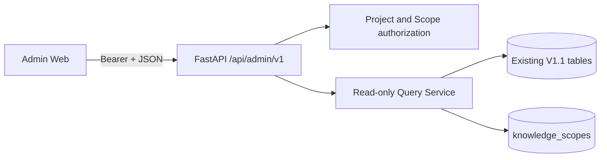

# Codex Memory V1.2 Architecture

## P0 runtime shape

P0 is an observation surface. It shares the existing SQLAlchemy session boundary with V1.1, but its route namespace and query mappers are isolated under `codex_memory.admin`. Existing `/api/v1/*` endpoints remain unchanged and no P0 route performs a business write.

The frontend lives in `apps/admin-web`, uses Vue 3, Vite, Element Plus, Pinia, and Vue Router, and keeps filter state in the URL. Vite proxies `/api` to the FastAPI process during local development.

## Request contract

Successful list responses use `data`, `meta`, and `request_id`. `meta` contains `page`, `page_size`, `total`, and `has_next`. Errors use a top-level `error` object with `code`, `message`, and `request_id`; every response includes `X-Request-ID`.
