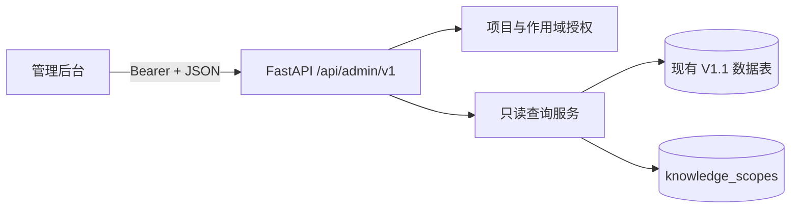

# Codex Memory V1.2 架构

## P0 运行形态

P0 是观测界面。它与 V1.1 共用现有 SQLAlchemy 会话边界，但路由命名空间和查询映射器隔离在 `codex_memory.admin` 下。现有 `/api/v1/*` 接口保持不变，P0 路由不执行业务写入。

前端位于 `apps/admin-web`，使用 Vue 3、Vite、Element Plus、Pinia 和 Vue Router，并将筛选状态保存在 URL 中。本地开发时，Vite 将 `/api` 代理到 FastAPI 进程。

## 请求契约

成功的列表响应使用 `data`、`meta` 和 `request_id`。`meta` 包含 `page`、`page_size`、`total` 和 `has_next`。错误响应使用顶层 `error` 对象，其中包含 `code`、`message` 和 `request_id`；每个响应都包含 `X-Request-ID`。